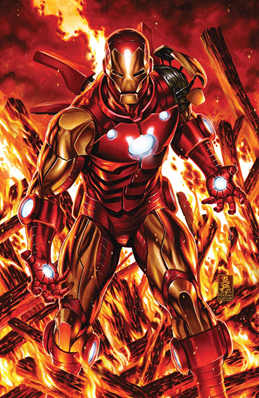

<div align="center">



# 🔐 IronKey

**Gerador de senhas seguras inspirado no universo Iron Man**

[](https://flutter.dev)
[](https://dart.dev)
[](https://m3.material.io)
[](https://github.com)
[](https://github.com)

</div>

---

## 📖 Sobre o Projeto

**IronKey** é um aplicativo Flutter multiplataforma de geração de senhas seguras com visual inspirado no universo do Homem de Ferro. O app oferece dois modos de geração: **PIN numérico** para senhas de acesso rápido, e **Senha Padrão** com controle granular sobre quais conjuntos de caracteres incluir — maiúsculas, minúsculas, números e símbolos.

O projeto foi desenvolvido com foco em boas práticas de orientação a objetos, utilizando o padrão de projeto **Strategy** por meio da interface abstrata `PasswordGenerator`, que permite adicionar novos tipos de geração sem alterar o código existente.

---

## ✨ Funcionalidades

| Funcionalidade | Descrição |
|---|---|
| ✅ **Geração de PIN** | Gera senhas numéricas com comprimento configurável |
| ✅ **Senha Padrão** | Gera senhas com combinação personalizável de caracteres |
| ✅ **Controle de comprimento** | Slider interativo para ajustar o tamanho (4 a 12 caracteres) |
| ✅ **Filtros de caracteres** | Toggle individual para maiúsculas, minúsculas, números e símbolos |
| ✅ **Nível de complexidade** | Seleção de complexidade: Baixa, Média ou Alta |
| ✅ **Campo editável** | Permite ativar a edição manual da senha gerada |
| ✅ **Copiar para área de transferência** | Cópia da senha com um toque |
| ✅ **Tema customizado** | Paleta de cores vermelho/dourado inspirada no Iron Man |
| ✅ **Suporte multiplataforma** | Android, iOS, Web, Windows, Linux e macOS |

---

## 🎨 Interface

<div align="center">

> A tela principal apresenta o mascote Iron Man, campo de senha, seleção de tipo (PIN ou Padrão), controles de personalização e botão de geração centralizado na parte inferior.

</div>

---

## 🛠️ Tecnologias Utilizadas

- **[Flutter](https://flutter.dev)** — Framework UI multiplataforma
- **[Dart 3.8+](https://dart.dev)** — Linguagem de programação
- **Material Design 3** — Sistema de design com `useMaterial3: true`
- **`dart:math`** — Geração de índices aleatórios para composição das senhas
- **`flutter/services`** — Acesso ao clipboard nativo

---

## 🏗️ Arquitetura

O projeto adota o padrão **Strategy** para a geração de senhas:

```
PasswordGenerator (abstract interface)
        │
        ├── PinPasswordGenerator       → Gera senhas apenas com dígitos (0–9)
        └── StandardPasswordGenerator  → Gera senhas com conjunto customizável de caracteres
```

A UI é organizada em um único `StatefulWidget` (`IronKeyScreen`) com estado local gerenciado via `setState`, adequado para a complexidade atual do projeto.

---

## 📁 Estrutura do Projeto

```
ironkey/
├── lib/
│   ├── main.dart                        # Entry point + IronKeyScreen (UI principal)
│   ├── app_theme.dart                   # Tema customizado (light/dark) + enum PasswordType
│   ├── password_generator.dart          # Interface abstrata PasswordGenerator
│   ├── standart_password_generator.dart # Implementação: senha padrão com filtros
│   ├── pin_password_generator.dart      # Implementação: senha numérica (PIN)
│   └── models/
│       └── password_complexity.dart     # Enum PasswordComplexity com extensão
├── assets/
│   └── images/
│       └── Iron_Man.png                 # Asset visual principal
├── android/                             # Configurações Android
├── ios/                                 # Configurações iOS
├── web/                                 # Configurações Web (PWA)
├── windows/                             # Runner Windows
├── linux/                               # Runner Linux
├── macos/                               # Runner macOS
└── pubspec.yaml                         # Dependências e assets
```

---

## 🚀 Como Executar

### Pré-requisitos

- Flutter SDK `^3.8.x` instalado
- Dart SDK `^3.8.1`
- Android Studio ou VS Code com extensão Flutter
- Dispositivo físico ou emulador configurado

### Passo a passo

```bash
# 1. Clone o repositório
git clone https://github.com/seu-usuario/iron-man-key.git

# 2. Acesse o diretório do projeto
cd iron-man-key

# 3. Instale as dependências
flutter pub get

# 4. Execute o projeto
flutter run
```

### Targets específicos

```bash
# Android
flutter run -d android

# Web
flutter run -d chrome

# Windows
flutter run -d windows

# Linux
flutter run -d linux
```

---

## 📦 Dependências

| Pacote | Versão | Uso |
|---|---|---|
| `flutter` | SDK | Framework principal |
| `cupertino_icons` | `^1.0.8` | Ícones estilo iOS |
| `flutter_lints` | `^5.0.0` | Análise estática de código |

---

## 🎨 Tema

O app possui paleta de cores customizada inspirada no Iron Man:

| Token | Light Mode | Dark Mode |
|---|---|---|
| Primary | `#B71C1C` (vermelho) | `#FFC107` (dourado) |
| Background | `#FFF4E6` (bege quente) | `#0D0B0B` (preto profundo) |
| OnPrimary | `#FFFFFF` | `#2A0000` |
| OnSurface | `#3A0000` | `#CFD8DC` |

---

## 🔄 Fluxo da Aplicação

```
Usuário abre o app
        ↓
Tela principal (IronKeyScreen)
        ↓
Seleciona tipo de senha: [PIN] ou [Padrão]
        ↓
(Opcional) Ativa modo de edição para personalizar:
   → Comprimento via Slider (4–12)
   → Complexidade (Baixa / Média / Alta)
   → Filtros de caracteres (maiúsculas)
        ↓
Pressiona "Gerar senha"
        ↓
Senha exibida no campo de texto
        ↓
Toca em [Copiar] para copiar para o clipboard
        ↓
SnackBar de confirmação: "Senha copiada!"
```

---

## 💡 Possíveis Melhorias

- [ ] Implementar controles completos para **minúsculas**, **números** e **símbolos** (campos já existem no estado, mas não renderizados na UI)
- [ ] Integrar o enum `PasswordComplexity` à lógica de geração (atualmente não afeta o output)
- [ ] Adicionar **tema escuro** funcional (atualmente `darkTheme` está apontando para `lightTheme`)
- [ ] Implementar **histórico de senhas** com armazenamento local
- [ ] Adicionar **indicador visual de força** da senha gerada
- [ ] Escrever **testes unitários** para os geradores
- [ ] Implementar **internacionalização** (i18n) para suporte a múltiplos idiomas
- [ ] Publicar na **Google Play Store** e **App Store**

---

## 👤 Autor

Desenvolvido por **João Victor** — [@QoreLab Solutions](https://qorelab.com.br)

---

<div align="center">

Feito com ❤️ e Flutter · IronKey © 2025

</div>


## Telas 


